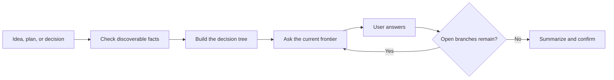

**English** | [简体中文](README.zh-CN.md)

<div align="center">
  <h1>Thought Refiner</h1>
  <p><strong>Turn vague thinking into clear decisions—one question at a time.</strong></p>
</div>

<p align="center">
  <a href="LICENSE"></a>
  
  
  
</p>

<p align="center">
  Facts → decision tree → current frontier → recommendations → confirmation.
</p>

---

## What is this?

**Thought Refiner** is an open-source Codex Skill for turning an unclear idea, plan, design, or decision into a complete and actionable direction.

Instead of jumping straight into execution, it maps the problem as a decision tree. It asks only the questions that can be answered now, explains each choice in plain language, recommends a default, and waits for confirmation before moving forward.

## Why use it?

| Capability | What it protects |
|---|---|
| 🌳 Dependency-aware questions | Later decisions are not asked before their prerequisites are settled |
| 🔎 Fact finding first | The agent checks discoverable facts instead of turning research into user homework |
| 🧭 Clear recommendations | Every meaningful choice comes with an opinionated default and a short reason |
| 💬 Plain-language rounds | Questions stay compact, readable, and aligned with the user's language |
| 🧩 Hidden-assumption checks | Unspoken constraints and missing branches become visible before execution |
| ✅ Confirmation gate | The final direction is summarized and confirmed before any follow-up work begins |

## How it works



The **current frontier** is the set of decisions whose prerequisites are already settled. Questions that depend on an unanswered decision wait for a later round.

## Quick start

### Install with the Skill installer

Ask Codex to install this Skill from the repository path:

```text
Use $skill-installer to install:
https://github.com/chenjieliefu/thought-refiner/tree/main/thought-refiner
```

### Install manually

Copy the `thought-refiner` folder into your personal Codex skills directory:

```text
$HOME/.agents/skills/thought-refiner
```

Codex normally detects new skills automatically. Restart Codex if it does not appear.

### Invoke

Thought Refiner uses explicit invocation, so mention it directly:

```text
Use $thought-refiner to help me decide whether this product idea is worth building.
Keep the questions simple and recommend a default for every choice.
```

You can also use it for a plan or design:

```text
Use $thought-refiner to stress-test my launch plan before I start execution.
```

## Good fits

- Product and startup ideas
- Project or launch plans
- Product and technical designs
- Important personal or team decisions
- Any proposal that still feels under-specified

## Repository structure

```text
.
├── README.md
├── README.zh-CN.md
├── LICENSE
└── thought-refiner/
    ├── SKILL.md
    └── agents/
        └── openai.yaml
```

## License

Released under the [MIT License](LICENSE).

---

<p align="center">
  <strong>Think it through before you build it.</strong>
</p>
