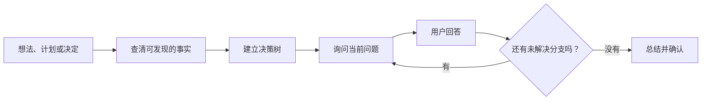

[English](README.md) | **简体中文**

<div align="center">
  <h1>Thought Refiner · 想法精炼师</h1>
  <p><strong>通过一轮轮简单追问，把模糊想法炼成清晰决定。</strong></p>
</div>

<p align="center">
  <a href="LICENSE"></a>
  
  
  
</p>

<p align="center">
  查清事实 → 建立决策树 → 询问当前问题 → 给出推荐 → 总结确认。
</p>

---

## 这是什么？

**想法精炼师**是一个开源 Codex Skill，用来把模糊的想法、计划、设计或决定整理成完整、清晰、可以执行的方向。

它不会一上来就替你执行，而是先把问题整理成决策树。每轮只问现在能够回答的问题，用简单语言说明选项，给出推荐答案，并在真正开始行动前请你确认最终方向。

## 为什么使用它？

| 能力 | 它能避免什么问题 |
|---|---|
| 🌳 按依赖关系提问 | 上层决定没确定时，不会提前追问下层细节 |
| 🔎 先查清事实 | 能直接查到的信息不会变成用户作业 |
| 🧭 给出明确推荐 | 每个重要选择都有默认建议和简短理由 |
| 💬 使用简单语言 | 问题保持简洁，并跟随用户正在使用的语言 |
| 🧩 找出隐藏假设 | 执行前暴露遗漏条件、约束和未讨论分支 |
| ✅ 最终确认 | 所有关键问题讨论清楚后，先总结再行动 |

## 它如何工作？



“当前问题”是指前置决定已经确定、现在就能回答的问题。依赖其他未决答案的问题会自动留到下一轮。

## 快速开始

### 使用 Skill 安装器

让 Codex 从下面的仓库路径安装：

```text
使用 $skill-installer 安装：
https://github.com/chenjieliefu/thought-refiner/tree/main/thought-refiner
```

### 手动安装

把仓库中的 `thought-refiner` 文件夹复制到个人技能目录：

```text
$HOME/.agents/skills/thought-refiner
```

Codex 通常会自动发现新技能。如果没有出现，重启 Codex。

### 调用

想法精炼师采用手动调用，使用时请明确提到它：

```text
使用 $thought-refiner，帮我判断这个产品想法值不值得做。
问题尽量简单，每个选择都给我一个推荐答案。
```

也可以用它检查计划或设计：

```text
使用 $thought-refiner，在开始执行前帮我检查这个发布计划。
```

## 适合讨论

- 产品或创业想法
- 项目与发布计划
- 产品或技术设计
- 重要的个人与团队决定
- 任何“感觉还没想透”的方案

## 仓库结构

```text
.
├── README.md
├── README.zh-CN.md
├── LICENSE
└── thought-refiner/
    ├── SKILL.md
    └── agents/
        └── openai.yaml
```

## 许可

使用 [MIT License](LICENSE) 发布，可以自由使用、修改和分享。

---

<p align="center">
  <strong>动手之前，先把它想清楚。</strong>
</p>
